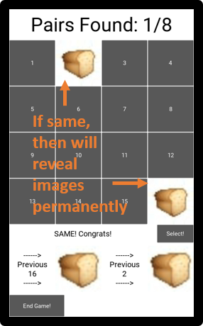

## Important Links
[Youtube Video Link](www.youtube.com), for the explaination and showcase of the game  
[GitHub Link](https://github.com/moobshake/Digital-World-Final-Project), can view or download the project here. Can view the markdown file the way it is suppose to be viewed  
## Concentration - A Memory Game!
Concentration takes inspiration from a game I played in childhood of the same name with a deck of poker cards. An online version of the game from 'MathIsfun.com' can be found [Here](https://www.mathsisfun.com/games/memory/index.html). This game can train the memorization ability of the player.    
It is a Memory Game that uses Python 3. The key libraries used are: 
>* KIVY (for GUI)
>* State Machine (for 'How to Play?' screen)
>* Random (for the game)  
## How to play the game?
The game tests the memory skills of the individual. The player can only open 2 buttons at any one time. If pairs that is open is not the same, the user will be able to see the images. However when they select another 2 buttons and open them, the images that are reveal will change to the current one that is selected. If the buttons have the same image, they will be revealed. The goal is to find **ALL** the matching pairs.  
_You can open the game to see 'how to play' **in-game** ('How to play' screen implements the use of State Machine)_  
_However if you prefer to view it here:_  
* **Step 1**: Press the game start button in the game!  
> 
* **Step 2**: Select the level that you want to try out! I will recommend choosing 'Easy' Level for first-timers!
> 
* **Step 3**: Choose 2 buttons and press 'Select to open them!'
> 
* **Step 4**: If the Two Buttons images are wrong, it will show at the bottom. The images and corresponding button number will be revealed to you.
> 
* **Step 5**: If the Two Buttons images are correct. The buttons will reveal their images and they are opened! The scoreboard will update. _Please repeat Step 3 to 5 until you found **ALL** the pairs!_
> 
* **Step 6**: This is what it will look like when you found all the pairs! Good luck and have fun!
> 
## Code Description
There are a total of 8 **main** classes and 1 **inner** class used in the project. The game uses **three** main libraries to function:
>1. KIVY (for GUI)
>2. State Machine (for 'How to Play?' screen)
>3. Random (for the game)  
We will go through them here:  
### The 8 Main Classes Used:
>**1. ConcGame(App)**  
>>* The main class which the game is ran from. It contains the App Class from Kivy. 
>>* This will initialise and add 5 classes with Screen Objects into a Screen Manager Object.
>>* It will return the Screen Manager Object to run.

>**2. StartScreen(Screen)**
>>* The first screen that the user will see as set back in the ConcGame class.
>>* Player can choose various buttons to go to different screens such as the 'Play', 'How to play?'
>>* There will be a 'Quit' button for the user to end the game and close the window
>>* Lastly, there is _mute/unmute button_ to mute or unmute the Background Music and Game Sound Effects.  

>**3. HowToPlayScreen(Screen)**
>>* **State Machine Class -TutorialSM(sm.SM)-** is placed inside here as the **_inner_** class. 
>>>- This State Machine will not be accessed by other Classes other than HowToPlayScreen class
>>* This Class shows how to play the game. The StateMachine is initilialised and keep track of the current Step it is showing.
>>* Two buttons, 'Back' and 'Next' changes the step of the StateMachine and shows the correct messages.  

>**4. Level(Screen)**
>>* To allow the user to select the level.
>>* Changes the Global List -gameLevel[0]- to store the level that the user selects.

>**5. LoadingScreen(Screen)**
>>* This class is created to display a 'Loading Screen' to buffer if the button images take too long to load, especially for the higher levels. 
>>* However, after testing with many people, the loading screen normally doesn't show cause it actually loads quite fast...

>**6. GameScreen(Screen)**
>>* The main class which the game is ran. It implements the magic function -on_pre_enter- to load all the buttons before it transition into this screen, it will be stuck in the Loading Screen if it loads too long. 
>>* Uses two other class. SelectableGrid to create and load in the buttons according to the level that is selected. WinPopup to popup a window to inform the user that they have won (Much more impactful than just a label showing the user has won)
>>* Contains **ALL the game logic**. Could have implemented StateMachine here but it is counter-intuitive as it will make the code longer and less elegant. Thus not implemented here.
>>* Contains various class variable for Sound effects. However, will check if the user has muted before playing the sound effect. 

>**7. SelectableGrid(FocusBehavior, CompoundSelectionBehavior, GridLayout)**
>>* This class creates a grid of buttons that is selectable.
>>* Checks and prevent user from selecting more than 2 buttons.
>>* Uses collision detection to check if the button is pressed instead

>**8. WinPopup(Popup)**
>>* Takes in the Popup class from Kivy but implement own layout.
>>* Will be used when the user win the game.

## Special Thanks To:
* ['Cainos' from Pixel Art](https://cainos.itch.io/pixel-art-icon-pack-rpg) for providing the pixel art that are used for the game.
* [Fesliyan Studios](https://www.fesliyanstudios.com/royalty-free-music), for the Royalty Free Musics.
